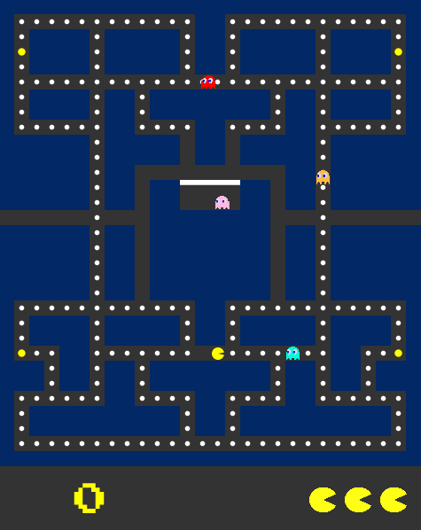

## Pac-Man

[Play here](http://www.ccincotti3.github.io/Pac-Man/)



### Background

Pac-Man is a classic arcade game released by Namco in 1980. This version of the game was written in JavaScript and uses the p5.js library for 2D rendering.

### How to Play

Navigate Pac-Man by using the `directional pad`. Collect all the pellets, and use caution as enemy ghosts will attempt to stop you in your tracks! You can defend against ghosts by eating Power Pellets to enter `Power Mode` which are located on the four corners of the grid. Press `P` to pause the game.

### Features

#### 2D Rendering & Collision Detection
All 2D rendering is done using the p5.js library, which is used to render objects in HTML Canvas. Since the `draw()` function is updated on every iteration, I used the always updating position of `Pac-Man` to determine if a collision was made against `Barriers`, `Pellets` or `Ghosts`.

Similar to the original Pac-Man, the player can queue a change in direction that will fire once the move becomes possible (ie. not blocked by a barrier).

```javascript
let target = grid[this.x + this.y * 28 + dx + dy * 28]
let oldTarget = grid[this.x + this.y * 28 + this.direction[0] + this.direction[1] * 28]

const wall = (type) => {
   return ["WALL", "GATE"].includes(type);
}

if(target && (!wall(target.type)) {
  this.direction = newDirection
} else if (target && (["WALL", "GATE"].includes(target.type)) && (!["WALL", "GATE"].includes(oldTarget.type))) {
  this.direction
} else if(target && (["WALL", "GATE"].includes(target.type))) {
  this.direction = [0, 0];
}
```

#### Ghost AI
Staying true to the original Pac-Man, ghost movements involve chasing Pac-Man, visiting 'their' corner of the board, and random scattering during `Power Mode`.

Both chasing and visiting mode involve calculating the shortest distance to Pac-Man and their corner respectively. Time is used to alternate between the two different modes. For 6 seconds, a ghost will be in visiting mode. After which, the ghost will enter chasing mode. This is repeated until the level is complete r the game is over.

Random scattering only occurs during `Power Mode` which involves choosing a random possible path and moving in that direction.

```javascript
let goToX = time > 6 ? pacX : this.cornerX;
let goToY = time > 6 ? pacY : this.cornerY;

if(!this.powerMode) {
  possibleDirections.forEach(dir => {
    let posSum;
    posSum = Math.sqrt((this.x + dir[0] - goToX)**2 + (this.y + dir[1] - goToY)**2)
    if(posSum < dirSum && this.moving !== false) {
      dirSum = posSum;
      newDirection = dir;
    }
  });
}
```
